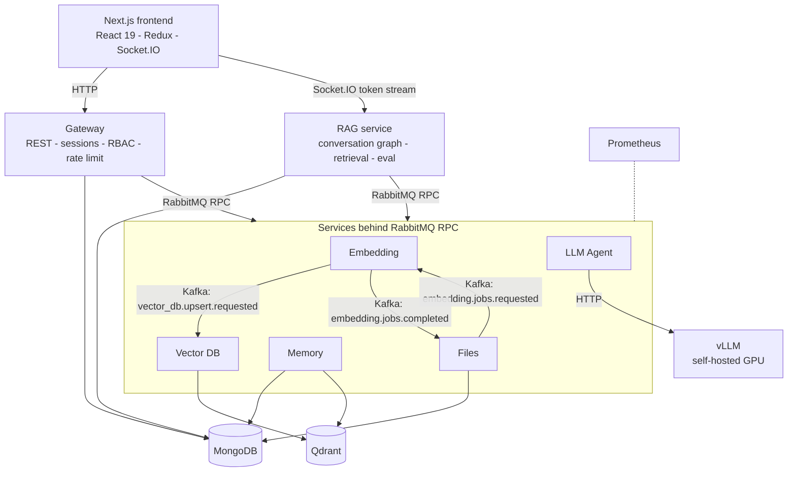
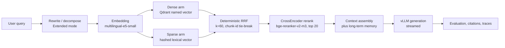

# RagForge

**A production-style, self-hosted AI/RAG platform — retrieval, model serving, memory, evaluation, distributed services, observability and concurrency engineering in one system.**

[](https://github.com/Vitaliyusf/ragforge/actions/workflows/ci.yml)


RagForge is not a "chat with your PDF" demo. It is eight backend services, a Next.js
frontend, a self-hosted GPU model server, two message transports and a measurement
discipline: every concurrency, retrieval and serving decision in this repository is
backed by a probe, a benchmark or a deterministic evaluation — and the ones that are
*not* measured say so explicitly. Hybrid dense + sparse retrieval with deterministic
fusion and learned reranking, bounded schedulers in front of every model, tenant-scoped
persistence, and a 624-scenario deterministic memory benchmark that produced a real
correctness fix rather than a nice chart.

### What this demonstrates

`Python` · `FastAPI` · `asyncio` · `Distributed services` · `RAG` · `Hybrid retrieval`
`Cross-encoder reranking` · `vLLM` · `Model serving` · `Qdrant` · `MongoDB` · `RabbitMQ`
`Kafka` · `Concurrency & backpressure` · `Prometheus` · `Evaluation & benchmarking`
`Multi-tenancy` · `Docker Compose` · `Next.js / React`

---

## Problem

Getting a RAG prototype to answer one question is a weekend. The interesting problems
start immediately afterwards:

- **Retrieval quality is not a vibe.** Dense-only retrieval misses exact terms; fusion
  must be deterministic and explainable, and reranking must survive load.
- **A single model instance is a shared resource.** Two concurrent users must not make
  each other's answers *worse* — a failure mode latency dashboards never show.
- **Unbounded concurrency is not throughput.** Every executor, queue and provider call
  needs a bound, a typed overload reply, and a metric.
- **"The answer looks good" is not evaluation.** Golden sets, IR metrics, retrieval
  traces, deterministic failure attribution and reproducible datasets are.
- **Tenancy is a server-side invariant**, never something a browser, a benchmark JSON
  file or a model tool call gets to choose.
- **Self-hosted inference has a capacity curve.** You measure where it bends rather than
  picking a concurrency number that sounds brave.

---

## Results / Metrics

Every row names its evidence and its evidence *type*. Nothing here is extrapolated to
production throughput: these are host-local measurements on one developer machine.

| Area | Before | After / result | Evidence type |
|---|---|---|---|
| **vLLM provider concurrency** | — | Concurrency **4** selected: 168.3 output tok/s, TTFT p95 **0.137 s**, E2E p95 1.52 s. Concurrency 8 reached 194.9 tok/s but TTFT p95 rose to **1.52 s** and E2E p95 to 2.62 s | Real-model fixed-shape probe (`scripts/perf/vllm_concurrency_probe.py`) |
| **Learned reranking under load** | 2nd concurrent turn answered `busy` and silently fell back to RRF ordering | **100% learned-rerank success, zero `busy`** at concurrency 1 / 2 / 4 / 8 and under mixed live+eval load; ordering identical to the uncontended result | Synthetic scheduler probe, stub model (`scripts/perf/reranker_concurrency_probe.py`) |
| **Reranker micro-batch window** | — | A 5 ms collection window bought no throughput and raised live p95 (c=4: 99.0 / 126.8 ms p50/p95 windowed vs **69.1 / 99.3 ms** opportunistic) → window defaults to **0** | Synthetic scheduler probe across three model cost shapes |
| **Embedding micro-batching** | per-caller `encode_batch([text], 1)` | interactive p50 **237 → 51 ms** at concurrency 8 and **439 → 70 ms** at 16 (throughput ×4.4 / ×6.4); mixed live+ingestion live p50 **561 → 106 ms** | Real model on CPU, medians of 3 runs |
| **Embedding live/background fairness** | ingestion could occupy every inference worker | live p95 under an ingestion flood **699 → 132 ms**, **786 → 443 ms**, **1045 → 515 ms** at live 1/4/8, with ingestion still at **213 items/s** | Real model on CPU, mixed-load benchmark |
| **Embedding semantics preserved** | — | max vector delta **5.4e-08** across the rewrite | Real-model equivalence check |
| **Qdrant hybrid search** | dense request → wait → sparse request → wait | both arms issued **concurrently** through one process-owned 2-permit executor; identical deterministic client-side RRF output | Live pinned-runtime benchmark, Qdrant v1.18.2 (`scripts/benchmarks/vector02_qdrant_operations.py`) |
| **Qdrant filtered delete** | scroll and materialise **every** matching point ID, then delete | exact filtered count + filter-native delete = **2 Qdrant calls, 0 client-materialised IDs**, exercised at 10 / 1 000 / 5 000 matching points | Live pinned-runtime benchmark |
| **Memory deletion correctness** | **0 of 24** resurrection-after-delete scenarios prevented; 24 forbidden retrievals | **24 / 24 prevented, 0 forbidden retrievals** via durable deletion identities | Deterministic evaluation |
| **Memory benchmark reproducibility** | identical runs returned nDCG 0.98922 / 0.99191 / 0.99345 on an unchanged dataset hash | deterministic projection reproducible run-to-run after the benchmark took ownership of its memory ids | Deterministic evaluation |
| **Automated tests** | — | ~**1 220** backend test functions across 8 suites plus ~**520** frontend tests, run per service in CI | Static count / CI |

> **Reading the labels.** *Real-model* means the pinned model actually ran. *Synthetic*
> means a deterministic stub stood in for the model so the **scheduler** was the thing
> under test. *Deterministic evaluation* means labelled scenarios with a pinned dataset
> hash and no LLM in the ground truth. A real-model reranker benchmark on the pinned
> `bge-reranker-v2-m3` is a named, still-open follow-up — the synthetic numbers above
> are not offered as a substitute for it.

---

## Architecture



**Two transports, two jobs.** RabbitMQ carries synchronous request/reply through one
multiplexed, correlation-id-routed transport per process. Kafka carries the durable,
replayable ingestion pipeline, where at-least-once delivery plus deterministic vector
IDs give idempotency — the repository deliberately does not claim exactly-once.

### Retrieval pipeline



Both arms run **concurrently** against the same Qdrant collection with **identical**
tenant and review filters, so the sparse arm can independently surface exact-term
matches without ever widening the authorization boundary.

---

## How a RAG request flows

1. The browser opens a Socket.IO session against the RAG service; the Gateway owns HTTP,
   opaque server-side sessions, CSRF/Origin validation and RBAC.
2. Identity is resolved server-side and travels to internal services as a **short-lived
   signed ticket** — never as client-supplied tenant/user JSON.
3. `input_guardrails` runs, then short-term conversation context and long-term memory are
   loaded (light in Regular mode, deep in Extended mode).
4. Extended mode rewrites or decomposes the query through the typed `llm_agent`
   `query_rewrite` contract.
5. The query is embedded through the embedding service's shared inference scheduler —
   one model instance, cross-request batching, live traffic prioritised.
6. Vector DB issues the dense and sparse Qdrant queries concurrently under a bounded
   executor and fuses them with deterministic client-side RRF.
7. Extended mode may run a second retrieval pass and merge candidates globally.
8. A bounded pool of candidates (default 20) is reranked by the pinned multilingual
   CrossEncoder through the process-level `RerankScheduler`.
9. Context is assembled, and the answer is generated by vLLM and streamed token by token;
   a fail-closed output guard governs what reaches the browser.
10. The turn is evaluated (groundedness, citations), persisted through a bounded async
    offload, and recorded as turn facts, Prometheus metrics and — opt-in — a bounded
    retrieval trace carrying per-arm ranks and provenance but never chunk text.

---

## Engineering highlights

<details open>
<summary><b>Learned reranking that survives concurrency</b></summary>

**Problem.** The reranker owned a `max_workers=1` executor and a single `_inflight`
future. A second concurrent turn found it busy, was answered `busy`, and its pipeline
fell back to the fused RRF ordering. The same query over the same corpus could therefore
return a different final ranking purely because of load — a *quality* regression that no
latency number reveals.

**Solution.** One process-level `RerankScheduler` behind the single CrossEncoder.
Concurrent requests queue on a bounded pending-pairs queue; workers flatten pending
`(query, candidate)` pairs into one forward pass and fan scores back by exact offsets, so
batching is invisible to callers — a request owns its query, its candidate order and its
own contiguous score slice, and a cancellation or failure cannot shift or strand a
neighbour. `busy` now survives only as *explicit admission overload*, separately
measurable from ordinary contention.

**Evidence.** 100% learned-rerank success and zero `busy` at concurrency 1/2/4/8 and
under mixed live+eval load, with ordering identical to the uncontended result (synthetic
scheduler probe). Model, revision, candidate generation, fusion, score semantics and
tie-breaking are unchanged.
</details>

<details>
<summary><b>Embedding: one model, a shared scheduler, and physical capacity reservation</b></summary>

**Problem.** The query RPC handler called `encode_batch([text], 1)` and the ingestion job
service ran its own batch loop, so concurrent callers never shared a forward pass. A
second problem appeared once they did: queue *priority* is worthless when ingestion
occupies every inference worker — a live query is ordered first in a queue nobody is free
to read, measured at 699 ms live p95 against a 332 ms background batch.

**Solution.** One process-level inference scheduler owns the model and every
`encode_batch` call. Callers submit logical items; the scheduler collects concurrently
pending items, bounded at 32 per physical batch and 256 pending globally, and fans
results back by position. Two fairness classes (live and background — eval schedules as
background) with a live pending reservation, plus a **physical** background slot bound so
at least one worker can always start live work. Overload raises a typed error that
becomes the existing RabbitMQ `service_overloaded` busy reply, and ingestion retries.

**Evidence.** Interactive p50 237 → 51 ms at concurrency 8; live p95 under an ingestion
flood 699 → 132 ms while ingestion *improved* to 213 items/s. The worker count moved
2 → 3 on measurement (77 vs 185 items/s at two workers), not on assumption.
</details>

<details>
<summary><b>Qdrant: overlapped arms and filter-native deletes</b></summary>

**Problem.** Hybrid search ran dense → wait → sparse → wait → fuse, and file/document
cleanup scrolled and materialised every matching point ID before deleting them — client
memory growing linearly with the number of deleted points.

**Solution.** The two independent arms run concurrently through a process-owned executor
bounded to two active calls, with identical eligibility filters. Deletion becomes an
exact filtered `count` followed by a filter-native `delete` — two calls, zero
materialised IDs, and the exact-count response contract preserved. One reusable client
per process, closed on shutdown, plus Qdrant operation metrics and a `chunk_id` payload
index.

**Why not Qdrant server-side fusion?** The pinned server supports it, but its fused
response cannot return the per-arm ranks and scores the retrieval trace contract needs,
nor enforce the chunk-id tie-break. Concurrency buys the latency overlap without
surrendering the diagnostics.
</details>

<details>
<summary><b>vLLM concurrency chosen from a measured knee</b></summary>

The `llm_agent` singleton owns one reusable bounded HTTP client and one fair,
process-wide admission budget shared by live, eval, summary, metadata, memory, rewrite,
risk and question-generation work. `MAX_CONCURRENT_REQUESTS=4` is simultaneously the
handler worker count and the provider inference ceiling, and the code *enforces* that it
cannot exceed `VLLM_MAX_NUM_SEQS`.

Four is not a guess. The fixed probe measured concurrency 4 at 168.3 output tok/s with
TTFT p95 0.137 s and no errors or timeouts; concurrency 8 reached 194.9 tok/s — a modest
throughput gain — while TTFT p95 rose to 1.52 s against a server still capped at four
sequences. For an interactive chat product, that trade is not worth taking.
</details>

<details>
<summary><b>RabbitMQ RPC multiplexing</b></summary>

**Before:** every call opened a channel and an exclusive reply queue; RAG opened a
channel per published event; Memory opened a fresh robust connection per embedding
request.

**After:** a shared `MultiplexedRabbitMQRPCClient` owns one connection, channel, exchange
and callback queue per process, with a correlation-id waiter registry, bounded in-flight
calls, timeout and cancellation cleanup, reconnect handling, thread-safe loop bridging
for Memory, and streaming plus fire-and-forget publishing on the same transport.
</details>

<details>
<summary><b>Memory that cannot resurrect a deleted fact</b></summary>

The deterministic Memory benchmark measured **0 of 24** resurrection-after-delete
scenarios prevented: every deleted fact was recreated by the next equivalent candidate
and then answered queries it had been removed from. Deletion state stored *on* the
canonical row cannot survive the row itself.

Deletion is now a **durable identity** — a content-free tombstone written before the row
and its vector are removed, matched against every later write candidate by canonical id,
supersedes target, scoped content hash, fact key or preference key, never by embedding
similarity alone. Result: 24/24 prevented, 0 forbidden retrievals. Supersession and
expiry are explicitly *not* deletion and keep their successor path.
</details>

---

## Production engineering

### Concurrency & backpressure

Every place work crosses into a thread, a model or a provider has an owner, a bound and
a metric:

| Boundary | Bound |
|---|---|
| Synchronous RPC handlers | Service-owned bounded executors, documented per service in [CONCURRENCY_BUDGETS.md](docs/ai/CONCURRENCY_BUDGETS.md) |
| Executor admission | Bounded wait (default 1 s), then a typed `ExecutorOverloaded` → `service_overloaded` reply |
| RabbitMQ RPC | One multiplexed transport per process, bounded in-flight |
| vLLM | One fair process-wide admission budget, aligned to `VLLM_MAX_NUM_SEQS` |
| Embedding | 1 model, 3 inference workers, 32 items/batch, 256 pending, live reservation |
| Reranker | 1 model, 2 inference workers, 64 pairs/batch, 512 pending, at most 1 background worker |
| Qdrant hybrid | 2-permit process-owned executor |

Backpressure is a *reply*, not a hang: saturation is surfaced as a typed overload the
caller can retry, and as `ragapp_executor_tasks_rejected_total` and
`ragapp_*_scheduler_rejected_total` counters an operator can alert on.

### Reliability

Differentiated connect/read/write/pool timeouts on the provider client; admission
overload distinguished from model read timeouts; cancellation cleanup that cannot strand
or shift a neighbouring request's scores; deterministic drain-then-fail shutdown for
every scheduler and pool; RabbitMQ reconnect handling; retry with exponential backoff,
circuit breakers and DLQ handling in the shared library; and at-least-once delivery made
safe by deterministic vector IDs and idempotent writes.

### Security & tenant isolation

- Opaque server-side sessions, CSRF and Origin validation, and `__Host-` cookies behind
  the production TLS overlay.
- Internal service calls carry **short-lived signed tickets** with issuer, audience,
  purpose and lifetime verification.
- Tenant/owner predicates are mandatory on Mongo queries and on every Qdrant search,
  delete, list and validation call — including both retrieval arms.
- Model tool output is untrusted: the Memory Agent may only reference ids from the
  server-supplied, tenant-scoped candidate set, and background chat-exit curation has no
  delete authority at all.
- Admin/user RBAC; browser role checks are UX only, the backend always authorizes.

Details and the honest limits live in [the multi-tenancy and security runbook](docs/multi-tenancy-security.md)
and [docs/ai/SECURITY.md](docs/ai/SECURITY.md).

### Observability

One shared Prometheus metric module with **closed label vocabularies**, enforced by a
test: no tenant ids, user ids, trace ids, filenames, prompts or exception text may ever
become a label. Instrumented boundaries include queue wait, in-flight by request class,
handler duration, executor saturation and rejections, RPC round-trip / timeouts /
in-flight, RabbitMQ delivery, Kafka lag and processing time, embedding batch size and
scheduler latency, reranker status and batch size, vLLM admission outcomes / TTFT /
output-tokens-per-second, Mongo and Qdrant operation duration, and an explicit
`ragapp_degraded_path_total` for fallbacks.

An unmeasured value is `null` or simply not observed — never a fabricated `0`. That rule
runs all the way to the UI, where an unmeasured review renders as absent rather than 0%.

---

## Evaluation & retrieval quality

Retrieval and answer quality are measured, not admired.

- **Golden-set IR metrics** — Recall@1/3/5/10/20, Precision@K, Hit@K, MRR, nDCG@5/10 and
  empty-retrieval rate — with eval candidate depth held separate from, and at least as
  large as, production context depth, so a Recall@20 number is never silently truncated
  by `TOP_K_DOCUMENTS`.
- **Ground truth stays eval-side.** Expected file/chunk/fact labels never touch live
  retrieval, so a benchmark cannot contaminate the system it measures.
- **Per-item retrieval traces** carry bounded ids, dense/sparse/fused ranks and arm
  provenance — never chunk text — collected opt-in so user turns are unaffected.
- **Deterministic failure attribution.** Every eval item is classified into
  index / retrieval / pass_two / ranking / context / completeness / generation /
  grounding / stale_labels / pipeline_error, or `unclassified` when evidence is
  insufficient. No LLM guesses a retrieval-stage failure.
- **Citation and groundedness metrics**, explicitly labelled as judge-evaluated proxies
  where a model produced them.
- **Benchmark provenance.** Runs carry a manifest built from live config and process
  environment — dataset id, version and sha256, model flags, git SHA — and a comparison
  declares runs "not directly comparable" rather than colouring a meaningless delta.
- **A 624-scenario deterministic Memory benchmark** (English / Hebrew / mixed, pinned
  dataset sha256) with separated extraction, lifecycle, retrieval, trajectory and
  final-context metrics, plus coverage for temporal validity, deletion, tenant isolation,
  adversarial input, idempotency and reconciliation. Its labels are generated *before*
  any Memory code runs, so a system output can never become its own ground truth.

That benchmark is also the best argument for building it: it is what found the
resurrection bug, and what caught its own nDCG varying between identical runs — traced to
random memory ids leaking into a rank tie-break, then fixed at the source rather than by
rounding the metric.

---

## Model serving

**Generation — vLLM, self-hosted.** One singleton client, one reusable bounded
`httpx.Client`, one fair provider admission budget, differentiated timeouts, and
deterministic shutdown. Structured output is enforced server-side through JSON-schema
`response_format` (with a capability probe and a legacy `guided_json` transport), not by
hoping the model returns valid JSON. The runtime profile is pinned:

| Setting | Effective default |
|---|---|
| Image | `vllm/vllm-openai:v0.27.1` |
| Model | `RedHatAI/Qwen3.5-4B-quantized.w4a16` (compressed-tensors) |
| Model runner | V1 (`VLLM_USE_V2_MODEL_RUNNER=0`) — the V2 runner needs CUDA UVA, unavailable in the accepted WSL2/Docker Desktop deployment |
| Context window | 10 240 tokens |
| GPU memory utilization | 0.85 |
| Max concurrent sequences | 4 |
| Max batched tokens | 2 048 |
| Performance mode | `interactivity`, prefix caching enabled |

These are defaults, not requirements; operators override them in `.env`. Per-action
output-token budgets are documented in
[LLM output-token budgets](docs/operations/llm-output-token-budgets.md).

**Embeddings — `intfloat/multilingual-e5-small`** (384 dims), baked into the image at
build time, with E5 query/passage prefixes, normalization, and all inference behind the
shared scheduler.

**Reranking — `BAAI/bge-reranker-v2-m3`**, pinned to revision
`b5160aeac3c6c8fe7beaaaf04c9e0142826b58d1`, one instance, scored through the bounded
`RerankScheduler`. A timeout or model error degrades deterministically to the RRF
ordering and is reported in metrics and eval traces rather than hidden.

---

## Service architecture

| Service | Responsibility | Key technologies |
|---|---|---|
| **gateway** | Browser-facing REST, sessions/auth, RBAC, rate limiting, circuit breakers, admin metrics and eval routes | FastAPI, MongoDB, RabbitMQ RPC |
| **rag** | Conversation graph (Regular/Extended), retrieval orchestration, reranking, evaluation, citations, checkpoints, benchmark runner, Socket.IO streaming | FastAPI, state-graph orchestration, Socket.IO, MongoDB |
| **llm_agent** | Typed LLM request contracts (chat, rewrite, summary, metadata, memory curation, evaluation), provider capacity, structured output | FastAPI, vLLM over HTTP, Pydantic |
| **embedding** | Document extraction (PDF/DOCX/MD/TXT), embedding model execution, shared inference scheduler | sentence-transformers, Kafka, RabbitMQ |
| **vector_db** | Qdrant collection ownership, hybrid dense+sparse search, RRF, filter-native deletes | Qdrant, Kafka |
| **memory** | Chat history, long-term memory lifecycle, bounded Memory Agent policy, reconciliation, deterministic eval suite | MongoDB (canonical), Qdrant (derived) |
| **files** | Upload, ingestion workflow, review/audit state, file lifecycle truth | FastAPI, MongoDB, Kafka |
| **logs** | Centralized structured log collection | FastAPI |
| **shared** | Auth, metrics, bounded executors, RPC transport, retry, circuit breaker, DLQ, sparse retrieval, guards | vendored into every service image |

Each service is an independently built and deployed container with its own
`requirements.txt` and its own test suite.

---

## Tech Stack

**Backend** — Python 3.12, FastAPI, Pydantic / pydantic-settings, asyncio, uv

**AI / retrieval** — vLLM, sentence-transformers, CrossEncoder reranking, Qdrant hybrid
named vectors, hashed lexical sparse vectors, reciprocal-rank fusion

**Messaging** — RabbitMQ 3.13 (aio-pika, native RPC), Apache Kafka (durable ingestion pipeline)

**Storage** — MongoDB 7, Qdrant v1.18.2

**Frontend** — Next.js 16, React 19, Redux Toolkit, Tailwind CSS 4, Socket.IO, Radix UI,
Framer Motion, Vitest

**Infrastructure** — Docker, Docker Compose, multi-stage builds, Caddy (production TLS overlay)

**Quality & observability** — Prometheus, pytest, mypy (strict on `shared` + `gateway`),
Ruff, GitHub Actions, benchmark and evaluation tooling

---

## Project Structure

```text
backend/
  gateway/      HTTP boundary - auth, RBAC, rate limiting, circuit breakers, RPC facade
  rag/          Conversation graph, retrieval, reranking, evaluation, benchmarks, Socket.IO
  llm_agent/    Typed LLM contracts, provider capacity, structured output
  embedding/    Extraction and embedding execution, shared inference scheduler
  vector_db/    Qdrant ownership, hybrid search, RRF, filter-native deletes
  memory/       Chat history, long-term memory, Memory Agent, deterministic eval suite
  files/        Upload, ingestion workflow, review and audit trail
  shared/       Auth, metrics, bounded executors, RPC transport, retry, guards
frontend/              Next.js 16 app - chat, files, metrics, eval, logs, models, health
scripts/perf/          Concurrency baseline harness and probes (host-side; no service imports it)
scripts/benchmarks/    Live Qdrant operation benchmark
docs/ai/               Architecture, benchmarking rules, concurrency budgets, decisions, security
docs/operations/       Runtime and operator references
.github/workflows/     CI - lint, strict mypy, per-service tests, frontend build, guardrails
docker-compose.yml     Full local stack
```

---

## Quick Start

**Prerequisites:** Docker and Docker Compose; an NVIDIA GPU with CUDA drivers and ~6 GB
VRAM for vLLM. Without a GPU every service except vLLM starts, but chat and RAG flows
fail at inference time.

```bash
git clone https://github.com/Vitaliyusf/ragforge.git && cd ragforge
cp .env.example .env
# Replace every replace-* value with an independent random secret.
# Optionally set HF_TOKEN if the selected model is gated.

docker compose --env-file .env up --build
```

On Windows the first two steps can be done for you — the script creates `.env` from the
template with an independent cryptographically random value per secret and leaves an
existing `.env` untouched:

```powershell
pwsh ./scripts/initialize_docker_env.ps1
```

The first run downloads the model and initializes vLLM, which takes several minutes:

```bash
docker compose logs -f vllm   # ready when "Application startup complete" appears
```

| Surface | URL |
|---|---|
| UI | http://localhost:3000 |
| Gateway API docs | http://localhost:8000/docs |
| RAG Socket.IO | http://localhost:8004/socket.io |

MongoDB, RabbitMQ, Kafka, Qdrant, vLLM and the worker APIs are intentionally not bound to
host ports. On first run the UI shows a one-time setup screen: the first account
registered becomes the workspace administrator, and the setup endpoint closes permanently
once any user exists.

**Smoke checks** with the stack running:

```bash
# Socket.IO, RAG orchestration, RabbitMQ RPC, token streaming, persistence
docker compose exec -T frontend node < tests/smoke_chat.js

# Upload endpoint through the durable Kafka pipeline into Qdrant
curl -F "file=@tests/fixtures/smoke_ingestion.txt;type=text/plain" \
  http://localhost:8000/v1/files/upload
```

---

## Testing & validation

The testing philosophy is **focused feedback locally, breadth in CI**. Focused
regressions prove the specific behavior a change touches — including deterministic
concurrency tests that sample real in-flight counts inside a blocking fake model, rather
than tests that pass on timing luck. Per-service suites run independently, milestone
checkpoints own the broad validation, and deterministic evaluations and benchmarks are
kept separate from unit tests with their own provenance and evidence labels.

[CI](.github/workflows/ci.yml) runs Ruff, strict mypy on `shared` + `gateway`, a
seven-service pytest matrix, the shared-library suite, frontend Vitest plus a production
Next.js build, repository guardrails (secrets, stray caches, compose drift), and
report-only Python/npm dependency audits. CI does **not** start the GPU Compose stack —
the smoke commands above are the operator check for live end-to-end behavior.

```bash
# One service
(cd backend/gateway && PYTHONPATH="$PWD:$PWD/.." pytest app/tests -q)

# Shared library - from backend/, not backend/shared/
(cd backend && PYTHONPATH="$PWD" pytest shared/tests -q)

# Frontend
(cd frontend && npm ci && npm test)

# Lint and types
ruff check backend/
mypy backend/shared backend/gateway/app --config-file mypy.ini
```

---

## Selected engineering decisions

**Why client-side RRF instead of Qdrant server-side fusion?**
The pinned Qdrant supports server-side fusion, but its fused response cannot preserve
per-arm ranks and scores or enforce the chunk-id tie-break that the retrieval trace and
determinism contracts depend on. Running the two arms concurrently recovers the latency
overlap without giving up the diagnostics — the same win, without the semantic cost.

**Why provider concurrency 4 and not 8?**
Concurrency 8 bought roughly 16% more output tokens/s while TTFT p95 went from 0.137 s to
1.52 s against a server still capped at four sequences. For an interactive chat surface,
time to first token *is* the product; the throughput was not worth it.

**Why bounded queues instead of more workers?**
More workers move a queue, they do not remove it — and they multiply load on whatever is
downstream. A bound plus a typed overload reply keeps authority where the capacity
actually lives (the GPU, the single model instance, Qdrant) and makes saturation
observable instead of latent.

**Why one model instance plus scheduling, rather than duplicating the model?**
A second CrossEncoder or embedding model would double VRAM/RAM for a resource whose
capacity is physical, and would make batch composition and determinism harder to reason
about. Scheduling in front of one instance keeps memory bounded, keeps scores identical
to the uncontended result, and makes capacity explicit.

**Why a 0 ms reranker micro-batch window?**
A cross-encoder runs a full forward pass per pair, so per-pair compute dominates per-call
overhead and a collection window has little to amortise. Measured across three model cost
shapes, a 5 ms window bought no throughput while raising live p95, so batching stays
opportunistic — a worker takes whatever is already queued and never waits. This is
explicitly flagged for revisit under a real-model GPU benchmark.

**Why RabbitMQ *and* Kafka?**
An earlier architecture ran everything over Kafka, including request/reply, which
required roughly 300 lines simulating RPC: a shared replies topic, a correlation-id →
future matcher, and a background router thread. RabbitMQ does that natively. Kafka stays
where durability and replay genuinely matter — the ingestion pipeline. See the
[design note](docs/design/2026-05-19-kafka-to-rabbitmq-hybrid-design.md).

**Why no Redis / Celery / Kubernetes?**
Recorded as an explicit decision: infrastructure is added for a measured need, not for
keyword coverage. The system already carries real distributed complexity; more platforms
would dilute rather than demonstrate engineering judgment.

---

## What RagForge demonstrates

- Distributed Python backend architecture with real service boundaries and typed contracts
- Applied LLM/RAG systems engineering beyond API calls: retrieval, fusion, reranking, memory
- Model serving as an engineering problem — capacity, admission, batching, fairness, structured output
- Async I/O, thread-pool ownership, backpressure, queue and transport design
- Vector database engineering: hybrid schemas, filter parity, deterministic fusion, deletion cost
- Observability with disciplined cardinality and no fabricated values
- Evaluation and benchmarking: golden sets, IR metrics, provenance, reproducibility, failure attribution
- Multi-tenancy and security as invariants that survive AI features
- Performance investigation: measure, change one thing, prove it, record why — including
  the judgment to *reject* a change that looked good but did not measure well

---

## Project status

| Area | Status |
|---|---|
| Core platform (services, transports, storage, auth, RBAC) | Stable |
| Retrieval (hybrid dense+sparse, RRF, learned reranking) | Stable |
| Model serving (vLLM, embeddings, reranker, structured output) | Stable |
| Evaluation (golden sets, traces, failure attribution, benchmark provenance) | Stable |
| Memory (V2 lifecycle, agent policy, deterministic eval) | Stable |
| Observability (metric contract, degraded paths) | Stable |
| Concurrency and backpressure track | Active — transport, executors, provider capacity, embedding, reranker and Qdrant have landed; memory/file I/O, DAG parallelism, Kafka lane parallelism and worker scale-out are the remaining stages |
| Frontend | Stable |

The concurrency track's remaining stages, and the real-model reranker benchmark, are open
by design and named as such rather than quietly implied to be finished.

---

## Further reading

- [Project context and core invariants](docs/ai/PROJECT_CONTEXT.md)
- [Concurrency baseline — the measurement contract](docs/ai/CONCURRENCY_BASELINE.md)
- [Per-service executor budgets](docs/ai/CONCURRENCY_BUDGETS.md)
- [Benchmarking and measurement rules](docs/ai/BENCHMARKING.md)
- [Durable architecture decisions](docs/ai/DECISIONS.md)
- [Security and multi-tenancy rules](docs/ai/SECURITY.md) and the [operator runbook](docs/multi-tenancy-security.md)
- [Kafka to RabbitMQ hybrid messaging design note](docs/design/2026-05-19-kafka-to-rabbitmq-hybrid-design.md)
- [Streaming output safety](docs/streaming-output-safety.md)

---

## Public Repo Scope

RagForge is a portfolio engineering project focused on the production problems that
appear *after* an AI prototype works: retrieval quality, model serving capacity,
concurrency and backpressure, evaluation, reliability, observability and distributed
backend design.

This is a curated public snapshot of the main development repository. It includes the
full application, the public CI workflow, operator and security documentation,
initialization scripts and repository guardrails; it excludes private development history
and internal operations artifacts. The Training tab (QLoRA fine-tuning) is hidden by
default because the finetuning service is not part of the public Compose stack — set
`NEXT_PUBLIC_ENABLE_TRAINING_TAB=true` to expose it.

Application controls alone are not a certification. Running this on the public internet
would additionally require external secret/KMS management, encrypted disks and backups,
MFA/enterprise identity for admins, ingress rate limiting, image and vulnerability
scanning, monitoring, a restore drill and an independent penetration test — all tracked
explicitly in the security runbook rather than assumed.
