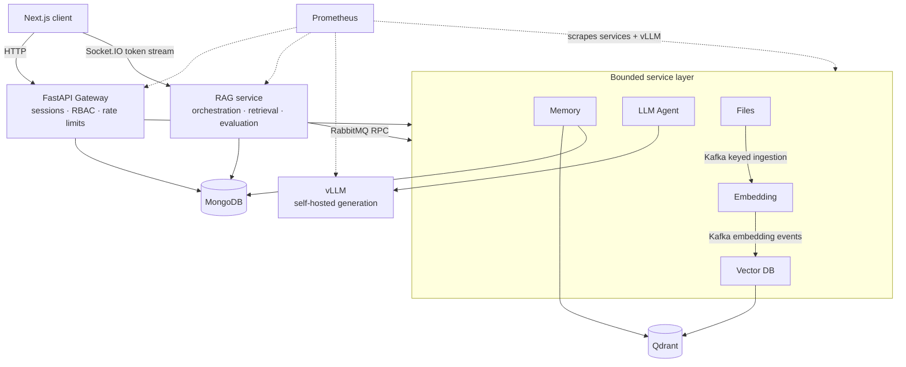
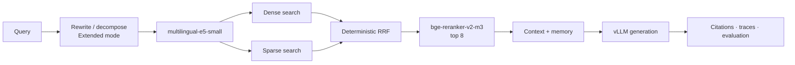

# RagForge

**A production-oriented, self-hosted RAG platform that treats retrieval quality,
model capacity, concurrency, failure handling, and evaluation as engineering
problems—not demo afterthoughts.**

[](https://github.com/Vitaliyusf/ragforge/actions/workflows/ci.yml)


RagForge combines eight Python services, a Next.js frontend, self-hosted vLLM,
hybrid retrieval, learned CrossEncoder reranking, deterministic evaluation, and
two deliberately different messaging systems. It is a portfolio project for the
work that begins after a RAG prototype answers its first question: preserving
quality under contention, bounding shared resources, proving failure behavior,
and making every performance claim traceable to evidence.

## Problem

- Dense retrieval alone misses exact terms; hybrid fusion must remain deterministic
  and apply identical tenant filters to every retrieval arm.
- Model instances are shared physical resources; traffic must not silently turn
  learned reranking into a lower-quality fallback.
- Unbounded tasks and executors hide overload; queues need owners, limits, typed
  rejection, and observable saturation.
- Answer quality needs versioned golden sets, IR metrics, traces, reproducible
  inputs, and deterministic failure attribution—not subjective spot checks.
- Durable ingestion and synchronous request/reply have different semantics, so
  Kafka and RabbitMQ are used for different jobs.

## Architecture



RabbitMQ owns bounded synchronous RPC through process-level multiplexed clients.
Kafka owns replayable, at-least-once document ingestion with deterministic keys
and idempotent vector writes. The project deliberately does not claim exactly-once
delivery.

## Key engineering highlights

- **Production RAG:** concurrent dense and sparse Qdrant search, deterministic
  reciprocal-rank fusion, learned multilingual reranking, bounded context assembly,
  citations, and streamed generation.
- **Model infrastructure:** one shared scheduler per embedding or CrossEncoder model,
  live/background capacity isolation, exact batched-result slicing, and vLLM
  concurrency selected from a measured latency/throughput knee.
- **Distributed messaging:** multiplexed RabbitMQ request/reply for online paths;
  keyed Kafka partitions and bounded workers for durable ingestion.
- **Concurrency and backpressure:** service-owned executors, fixed task graphs,
  bounded model queues, typed overload replies, cancellation cleanup, and
  deterministic shutdown.
- **Reliability:** retries, circuit breakers, dead-letter handling, idempotent writes,
  replica failure continuity, and explicit degraded-path metrics.
- **Security:** server-derived identity, short-lived signed internal tickets,
  tenant predicates across MongoDB and Qdrant, RBAC, CSRF/Origin checks, and
  fail-closed streaming controls.

## Results / Metrics

These are accepted, host-local results on named workloads—not production traffic or
generic end-to-end throughput. Evidence grades are defined in the
[concurrency closeout](docs/ai/CONCURRENCY_EVIDENCE.md).

| Area | Accepted result | Evidence and boundary |
| --- | --- | --- |
| Retrieval quality | **0.9872 nDCG@10**, 220/220 evaluated, 0 stale/unscorable/failed | Grade A real-corpus deterministic evaluation |
| CrossEncoder work | **20 → 8 candidate pairs/request (60% fewer)** while retaining the Retrieval220 result | Grade A accepted real-text/config workload; not an E2E latency claim |
| vLLM operating point | At concurrency 4: **168.3 output tok/s**, TTFT p95 **0.137 s**, E2E p95 **1.52 s**, 0 errors/timeouts | Grade A fixed-shape model-service probe; hardware/model specific |
| Memory evaluation | **624 scenarios**, nDCG **0.9904** across English, Hebrew, and mixed inputs | Grade C deterministic synthetic evaluation using its documented measurement stub; independent of concurrency work |
| Memory scaleout | Bounded reads **334.394 → 839.850 req/s** from 1→2 replicas; **2000/2000** succeeded after one replica stopped | Grade A real service/broker evidence; read-only 1-vs-2 workload only |
| Kafka ordering | Live four-partition run with cross-partition overlap and **0 ordering violations, 0 errors, 0 final lag** | Grade A broker contract verification; not a production throughput claim |
| Gateway request DAG | Context-stage p95 **110.03 → 47.54 ms (56.8% lower)** | Grade B controlled production-code microbenchmark; not E2E RAG latency |

## RAG and retrieval



Dense and sparse searches run concurrently against the same collection with the
same authorization and review filters. Client-side RRF preserves per-arm ranks,
provenance, and a deterministic chunk-ID tie-break. Extended mode can rewrite or
decompose a query and merge a second retrieval pass before reranking.

## Distributed systems and concurrency

Every boundary has an owner and a limit: RabbitMQ in-flight calls, synchronous
service executors, Kafka partition workers, vLLM provider requests, embedding
items, CrossEncoder candidate pairs, and Qdrant hybrid calls. Saturation becomes a
typed retryable overload response and a low-cardinality metric rather than an
unbounded queue or a silent quality fallback.

Kafka keys all dependent events for one document to the same partition, preserving
same-document order while independent partitions overlap. Memory demonstrates
opt-in horizontal scaling through RabbitMQ competing consumers because its durable
state lives in MongoDB and Qdrant; model-owning and connection-owning services are
not presented as transparently scalable.

See the [accepted concurrency and scaling evidence](docs/ai/CONCURRENCY_EVIDENCE.md),
[capacity budgets](docs/ai/CONCURRENCY_BUDGETS.md), and
[Kafka/RabbitMQ design rationale](docs/design/2026-05-19-kafka-to-rabbitmq-hybrid-design.md).

## Reliability and security

Provider calls use differentiated timeouts, bounded admission, retry/circuit-breaker
policies where appropriate, and deterministic cancellation and shutdown behavior.
Kafka ingestion retains at-least-once delivery and commit-on-success; deterministic
vector IDs make redelivery safe. Memory deletions use durable, content-free identities
so a later equivalent candidate cannot resurrect a deleted fact.

Identity and tenant scope originate only from trusted server context. Internal calls
carry signed, purpose-bound tickets; MongoDB and Qdrant operations enforce tenant/owner
predicates; model-tool output is constrained to server-supplied candidate IDs. See the
[security rules](docs/ai/SECURITY.md) and
[multi-tenancy/deployment runbook](docs/multi-tenancy-security.md) for controls and
explicit internet-deployment gaps.

## Evaluation

- Golden-set retrieval metrics include Recall, Precision, Hit rate, MRR, nDCG, and
  empty-retrieval rate, with evaluation depth separated from production context depth.
- Ground-truth labels remain eval-side and cannot influence live retrieval.
- Opt-in bounded traces record IDs, dense/sparse/fused ranks, and provenance—never
  private chunk text.
- Failure attribution separates index, retrieval, ranking, context, generation,
  grounding, stale-label, and pipeline failures without asking an LLM to guess.
- Dataset hashes, configuration, model flags, and Git revision travel with results;
  incomparable runs are labelled rather than given a misleading delta.

The methodology is documented in
[benchmarking and measurement rules](docs/ai/BENCHMARKING.md).

## Observability

Prometheus scrapes all seven application services plus vLLM. Shared metrics cover
request and stage latency, queue wait, in-flight work, executor saturation, RPC
timeouts, Kafka lag, scheduler batch size/rejections, TTFT, token throughput,
storage operations, and explicit degraded paths. Label vocabularies are closed and
tested: tenant IDs, user IDs, prompts, filenames, trace IDs, and exception text are
forbidden as labels. Unknown values remain absent or `null`, never invented as zero.

The authenticated frontend includes health and metrics surfaces backed by the Gateway;
Prometheus remains internal by default. The executable metric contract lives in
[`backend/shared/metrics.py`](backend/shared/metrics.py) and the scrape topology in
[`docker/prometheus/prometheus.yml`](docker/prometheus/prometheus.yml).

## Tech Stack

| Layer | Technologies |
| --- | --- |
| Backend | Python 3.12, FastAPI, Pydantic, asyncio, Socket.IO |
| AI and retrieval | vLLM, sentence-transformers, CrossEncoder, Qdrant dense+sparse search, RRF |
| Messaging and data | RabbitMQ, Kafka, MongoDB, Qdrant |
| Frontend | Next.js 16, React 19, Redux Toolkit, Tailwind CSS 4, Vitest |
| Operations | Docker Compose, Caddy, Prometheus, GitHub Actions |
| Quality | pytest, strict mypy on shared/gateway, Ruff, deterministic eval tooling |

## Quick Start

**Prerequisites:** Docker with Compose and an NVIDIA GPU with CUDA drivers and about
6 GB VRAM for the default vLLM profile. Without a GPU, the supporting services can
start but chat/RAG inference will not complete.

```bash
git clone https://github.com/Vitaliyusf/ragforge.git
cd ragforge
cp .env.example .env
# Replace every replace-* placeholder with a different random secret.
docker compose --env-file .env up --build
```

On Windows, `pwsh ./scripts/initialize_docker_env.ps1` creates `.env` with independent
random secrets and leaves an existing file untouched. The first model download can take
several minutes; readiness appears in `docker compose logs -f vllm`.

| Surface | URL |
| --- | --- |
| Web UI | http://localhost:3000 |
| Gateway API docs | http://localhost:8000/docs |
| RAG Socket.IO | http://localhost:8004/socket.io |

The first registered account becomes the workspace administrator; the setup endpoint
closes once any user exists. Infrastructure services are not exposed to the LAN by
default. For TLS and secure-cookie deployment, use the documented
[production overlay](docs/multi-tenancy-security.md#8-production-deployment).

## Project Structure

```text
backend/
  gateway/      HTTP boundary, auth/RBAC, rate limits, RPC facade
  rag/          RAG graph, retrieval, reranking, evaluation, streaming
  llm_agent/    Typed LLM contracts and provider-capacity ownership
  embedding/    Extraction, embeddings, and shared inference scheduling
  vector_db/    Qdrant ownership, hybrid search, fusion, deletion
  memory/       Chat history, long-term memory, deterministic evaluation
  files/        Upload and durable ingestion workflow
  shared/       Auth, metrics, bounded executors, transports, resilience
frontend/       Next.js application and operator/evaluation surfaces
docker/         Images, service configuration, Prometheus configuration
docs/           Architecture, evidence, security, and operational decisions
scripts/        Environment initialization and measurement tooling
```

## Engineering tradeoffs and known boundaries

- Results are local, workload-specific evidence; the full stack has not been presented
  as production-traffic or integrated-soak proof.
- Memory scaleout is demonstrated only for a bounded read workload with two replicas.
- Kafka application topics require explicit partition provisioning in a real deployment.
- RAG owns Socket.IO and process-local model/task state; transparent replica scaling
  requires an explicit connection and task-ownership design.
- The Gateway rate limiter is process-local; multi-replica deployment needs shared
  rate-limit state or a deliberately per-replica policy.
- CrossEncoder cold-start readiness and a final mixed-stack soak remain follow-ups.
- Internet exposure additionally requires external secret management, encrypted
  backups, MFA/enterprise identity, ingress controls, image scanning, alerting,
  restore drills, and an independent security review.

## Technical depth

- [Architecture, services, and invariants](docs/ai/PROJECT_CONTEXT.md)
- [Accepted concurrency, retrieval, Kafka, and scaleout evidence](docs/ai/CONCURRENCY_EVIDENCE.md)
- [Retrieval and benchmark methodology](docs/ai/BENCHMARKING.md)
- [Concurrency measurement contract](docs/ai/CONCURRENCY_BASELINE.md)
- [Durable architecture decisions](docs/ai/DECISIONS.md)
- [Security and multi-tenancy runbook](docs/multi-tenancy-security.md)
- [Streaming output safety](docs/streaming-output-safety.md)
- [CI validation workflow](.github/workflows/ci.yml)

## Public Repo Scope

This is a curated portfolio snapshot of the main development repository. It includes
the application, public CI, operator/security documentation, initialization scripts,
measurement tooling, and the engineering task/decision record used to keep long-running
AI-assisted work reproducible. Private handoffs, raw logs, runtime data, local caches,
secrets, benchmark archives, and generated index state are excluded by Git rules.

The optional QLoRA training UI is hidden because its service is not part of the public
Compose stack. Application controls are not a production certification; the deployment
gaps above are deliberate, documented boundaries.
